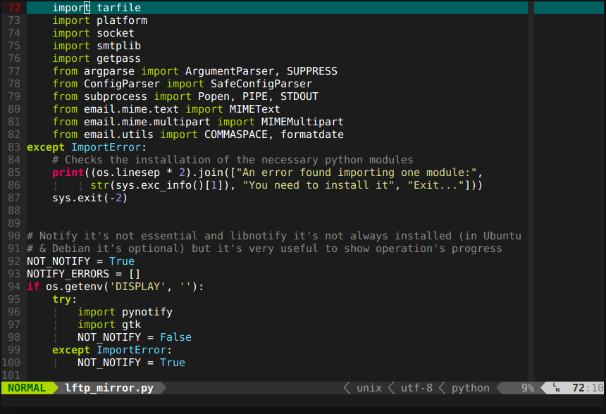

# Mi Configuración de Vim

El propósito de este documento es recopilar todas las opciones disponibles en mi
configuración para poner un poco de orden en la misma y servirme de recordatorio
de todo lo que tengo disponible.

## Indice

 - [Esquemas de color](#Header ID)
     - [Temas oscuros](#dark)
        -   [vim-molokai256](#mlk256)

## Esquemas de color {#colorschemes}

### Temas oscuros {#dark/}

##### vim-molokai256 {#mlk256}

Este es el tema por defecto para consola, es el tema molokai adaptado para
consola

![molokai256][mlk256]

  [mlk256]: pictures/molokai256.png "vim-molokai256"

